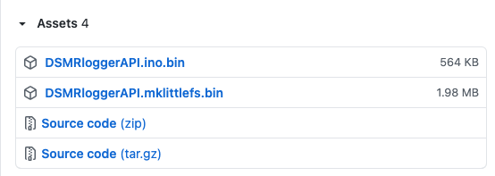

# Nieuwe DSMRloggerAPI firmware flashen

Nieuwe DSMRloggerAPI firmware kan via de web-interface van de DSMR-logger "_Over the Air_" geflashed worden maar mocht dat, om de één of andere reden niet lukken dan kunnen de pré compiled binaries ook bedraad geflashed worden.

1. [OTA met de Update Server flashen](nieuwe-dsmrloggerapi-firmware-flashen.md#ota-flashen-met-de-update-server)
2. [Bedraad met het Espressif flash Tool](nieuwe-dsmrloggerapi-firmware-flashen.md#bedraad-flashen-met-het-espressif-flash-tool)


Hoe je de firmware moet upgraden van _DSMRlogger**WS**_ naar _DSMRlogger**API**_ ****staat [hier](upgrade-dsmrloggerws-naar-dsmrloggerapi.md) beschreven!


### Pre compiled Binaries

Op [github](https://github.com/mrWheel/DSMRloggerAPI) staan van de major releases binaries van zowel de firmware als van het LittleFS bestand systeem. 

Klik op "[releases](https://github.com/mrWheel/DSMRloggerAPI/releases)" en download het meest recente of door jou gewenste `DSMRloggerAPI.ino.bin` bestand \(deze staan onder iedere release beschrijving bij "_Assets_"\).


Bij een gewone firmware update is het meestal niet nodig ook het bestand system opnieuw te downloaden en te flashen.


Onder iedere release beschrijving staan de bijbehorende "_Assets_".


Vanaf versie 3 van de firmware zijn er geen compiler opties meer die de firmware voor een bepaald type Slimme Meter geschikt maken. Alleen in het zeer specifieke geval waarbij je wilt testen of debuggen kan het nodig zijn om zelf de binaries te compileren.


### OTA flashen met de Update Server

Ga nu op de DSMR-logger naar de FSmanager \(door op het icoon  te klikken\) en klik vervolgens op de knop `[Update Firmware]`.

Klik nu op de bovenste `[Choose File]` knop 

Selecteer in het popup-window het zojuist gedownloade `DSMRloggerAPI.ino.bin` file:

Klik op `[Open]` of `[Select]` en klik vervolgens op de knop `[Flash Firmware]`.   
Na enige tijd verschijnt het volgende scherm:

.. waarna, zodra de teller op nul staat, het hoofdscherm van de DSMR-logger weer verschijnt.


Alleen als in de beschrijving van een release staat dat ook het bestand system opnieuw geflased moet worden moet u dit doen. In veel gevallen zal volstaan om eventueel een bepaald bestand naar de DSMR-logger te uploaden. Ook dit zal dan expliciet in de release beschrijving staan.


### Bedraad flashen met het Espressif Flash Download tool

Espressif heeft voor zijn ESP-boards een \(helaas alleen Windows\) tool ontwikkeld dat het bedraad flashen erg eenvoudig maakt.

Het tool kun je [hier](https://www.espressif.com/en/support/download/other-tools) downloaden.

Pak het .zip file uit \(unzip\) en start het door op het mapje te klikken:

Klik nu op "flash\_download\_tools.exe" en selecteer \[esp8266 DownloadTool\] in het volgende scherm:

Selecteer de twee bin bestanden. Het **`DSMRloggerAPI.ino.bin`** bestand moet op adres **0x0** starten, het **`DSMRloggerAPI.mklittlefs.bin`** op adres **0x200000**. Selecteer de COM poort waar de DSMR-logger op is aangesloten, _zet de DSMR-logger in flash mode_ en klik op `[START]`. Na enige tijd krijg je de melding dat alles goed is gegaan.

